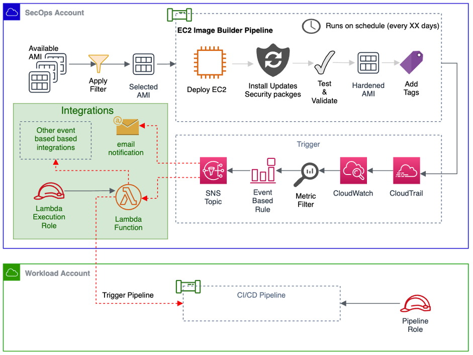

# EC2 Image Builder Pipeline : Notification and Integration - Terraform Sample Code

## Background
Currently there is no built-in mechanisms to get notified when the EC2 Image Builder completes building an AMI. This project aims to provide customer flexible options to integrate EC2 Image Builder pipeline with other selected AWS services. 

## Overview
This guide provides architecture reference and sample terraform code to build EC2 image builder pipeline and notification/integration methods to connect with other selected AWS services.

## Sample Customer Use Case
The SecOps team of ABC company enforced all workload AWS accounts to use only the hardened AMI prepared and shared by them in the SecOps account using automated EC2 Image builder pipeline. The SecOps team now wants to automatically notify the consumer account/service when a new AMI is available.

## High Level Solution Overview
The diagram below illustrates the high level overview of the solution



## Deployment Architecture of the sample code
The terraform IaC (Infrastructure as a Code) deploys the following components in order to build the sample dynamic website.
- EC2 Imagebuilder Pipeline (Image Recipe, Distribution Configuration, Iinfrastructure configuration)
- IAM role for EC2 Imagebuilder Pipeline (Instance profile role)
- Amazon S3 Bucket for AWS CloudTrail logs
- IAM role for AWS CloudTrail
- AWS Cloudtrail
- Amazon CloudWatch Log group and log metric filter
- AWS Lambda function
- AWS IAM role for lambda execution
- Amazon SNS

## Prerequisites

### Tools and knowledge

You should have the following installed in your machine:

* [AWS CLI](https://docs.aws.amazon.com/cli/latest/userguide/install-cliv2.html)
* [Terraform CLI](https://www.terraform.io/downloads.html)

Note: The commands below assumes that the machine used is macOS. Please adjust the commands accordingly to the Operating System of your choice.

You should also have working knowledge of:

* Terraform
* AWS EC2/ Amazon Machine Images (AMI)
* EC2 Image Builder
* Amazon CloudWatch
* AWS CloudTrail
* AWS Lambda
* Amazon SNS
* AWS IAM

### Deploy sample code

Issue the following commands to deploy the code to target AWS account

```bash

terraform init

terraform apply -auto-approve
```

## Destroy Environment

To destroy the demo environment, issue the following command

```bash
terraform destroy -auto-approve
```

## References
https://aws.amazon.com/image-builder/
